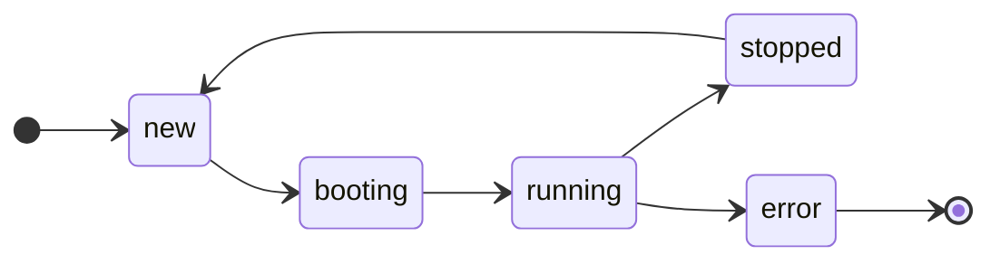
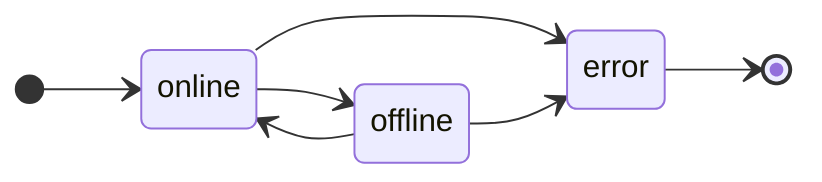
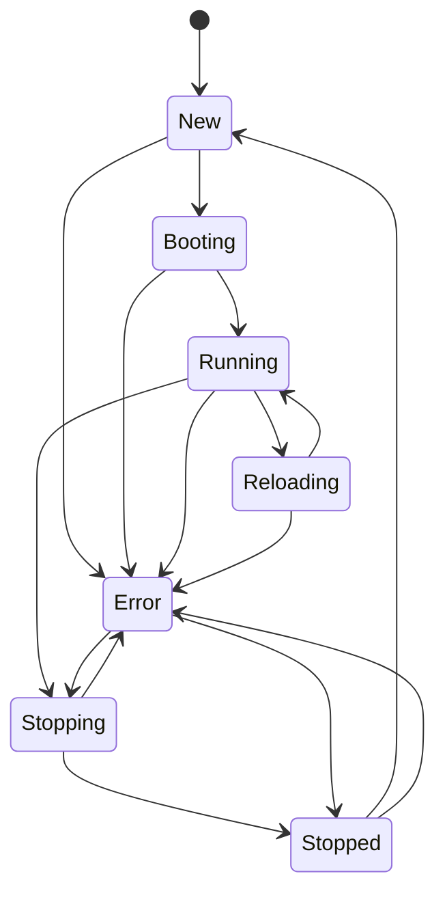

# go-fsm

[](https://pkg.go.dev/github.com/robbyt/go-fsm)
[](https://goreportcard.com/report/github.com/robbyt/go-fsm)
[](https://sonarcloud.io/summary/new_code?id=robbyt_go-fsm)
[](LICENSE)

A finite state machine that supports custom states and allowed transitions with pre/post-transition hooks for validation or notification.

## Table of Contents

- [Features](#features)
- [Installation](#installation)
- [Quick Start](#quick-start)
- [Usage](#usage)
  - [Defining Custom States and Transitions](#defining-custom-states-and-transitions)
  - [Creating an FSM using the "Typical" Transition Set](#creating-an-fsm-using-the-typical-transition-set)
  - [Changing State](#changing-state)
  - [Inspecting Allowed Transitions](#inspecting-allowed-transitions)
  - [State Transition Callbacks](#state-transition-callbacks)
  - [Subscribing to State Changes](#subscribing-to-state-changes)
- [Thread Safety](#thread-safety)
- [License](#license)

## Features

- Define custom states and allowed transitions
- Inspect allowed transitions from the current state (`IsTransitionAllowed`, `AvailableTransitions`, `IsTerminal`)
- Thread-safe state management using atomic operations
- Functional hook callbacks (pre-transition hooks, post-transition hooks)
- Subscribe to state changes via channels with context support
- Structured logging with `log/slog`

## Installation

```bash
go get github.com/robbyt/go-fsm/v2
```

Upgrading from v1? See the [v1 → v2 upgrade guide](docs/v2-upgrade.md).

## Quick Start

This example creates an FSM and transitions through states:



```go
package main

import (
	"fmt"
	"log/slog"

	"github.com/robbyt/go-fsm/v2"
)

func main() {
	logger := slog.Default()
	transitions := map[string][]string{
		"new":     {"booting"},
		"booting": {"running"},
		"running": {"stopped", "error"},
		"stopped": {"new"},
		"error":   {}, // terminal state
	}

	// Create a new FSM with an initial state and a map of allowed transitions
	machine, err := fsm.NewSimple("new", transitions, fsm.WithLogger(logger))
	if err != nil {
		logger.Error("failed to create FSM", "error", err)
		return
	}
	fmt.Println("Initial State:", machine.GetState())

	// Transition through a series of states
	states := []string{"booting", "running", "stopped"}
	for _, state := range states {
		if err := machine.Transition(state); err != nil {
			logger.Error("transition failed", "to", state, "error", err)
			return
		}
		fmt.Printf("Transitioned to: %s\n", machine.GetState())
	}

	// This transition is not allowed and will fail
	err = machine.Transition("running") // Can't go from "stopped" to "running"
	if err != nil {
		logger.Error("invalid transition was rejected", "error", err)
	}
	fmt.Println("Final State:", machine.GetState())
}
```

A complete, runnable version of this program is in [`example/main.go`](example/main.go).

## Usage

### Defining Custom States and Transitions

This example demonstrates a machine with online/offline states that can transition to an error state:



```go
// Simple machine definition with an inline map
machine, err := fsm.NewSimple("online", map[string][]string{
	"online":  {"offline", "error"},
	"offline": {"online", "error"},
	"error": {},
})
```

```go
// Advanced transition definition by creating a transitions object
import (
	"github.com/robbyt/go-fsm/v2"
	"github.com/robbyt/go-fsm/v2/transitions"
)

customTransitions := transitions.MustNew(map[string][]string{
	"online":  {"offline", "error"},
	"offline": {"online", "error"},
	"error": {},
})
machine, err := fsm.New("online", customTransitions)
```

### Creating an FSM using the "Typical" Transition Set

The `transitions` package provides predefined transition sets. This example uses the `Typical` configuration, which represents an application lifecycle:



```go
import (
	"log/slog"

	"github.com/robbyt/go-fsm/v2"
	"github.com/robbyt/go-fsm/v2/transitions"
)

machine, err := fsm.New(
	transitions.StatusNew,
	transitions.Typical,
	fsm.WithLogger(slog.Default()),
)
if err != nil {
	// Handle error
}
```

### Changing State

There are several ways to change the FSM's state.

```go
import (
	"context"
	"time"
)

// The following examples assume this setup:
// machine, _ := fsm.NewSimple("online", map[string][]string{
// 	"online":  {"offline"},
// 	"offline": {"online"},
// })

// Transition: The standard way to change state.
// It respects the allowed transitions and executes hooks.
err := machine.Transition("offline")

// TransitionWithContext: Pass a context for cancellation or deadlines.
// The context is passed down to all hooks.
ctx, cancel := context.WithTimeout(context.Background(), 100*time.Millisecond)
defer cancel()
err = machine.TransitionWithContext(ctx, "offline")

// TransitionIfCurrentState: An atomic "compare-and-swap" operation.
// The transition only occurs if the FSM is in the expected 'from' state.
err = machine.TransitionIfCurrentState("online", "offline")

// SetState: Force the FSM to a new state, bypassing transition rules
// and pre-transition hooks. Post-transition hooks will still be executed.
// This is useful for initialization or error recovery.
err = machine.SetState("offline")

// GetState: Returns the current state.
currentState := machine.GetState()
```

### Inspecting Allowed Transitions

These read-only helpers report what the FSM can do from its current state, without mutating it. They are useful for gating UI/decisions or detecting completion. Each is a lock-free, point-in-time snapshot (like `GetState`); for an atomic check-then-act, use `TransitionIfCurrentState` instead.

```go
// IsTransitionAllowed: is a transition to the given state allowed right now?
if machine.IsTransitionAllowed("offline") {
	_ = machine.Transition("offline")
}

// AvailableTransitions: the states reachable from the current state,
// sorted alphabetically (empty when the current state is terminal).
next := machine.AvailableTransitions() // e.g. []string{"offline"}

// IsTerminal: true when the current state has no outgoing transitions.
if machine.IsTerminal() {
	// the machine has reached an end state
}
```

### State Transition Callbacks

Callbacks follow the Run-to-Completion (RTC) execution model. They are registered on a `hooks.Registry`, which is then passed to the FSM via `fsm.WithCallbackRegistry`.

#### Callback Execution Order

Callbacks execute in this order during a transition:

1. **Validate transition is allowed** - Check if the transition is defined in the FSM configuration
2. **Pre-Transition Hooks** - Perform work and validation during the transition (can reject)
3. **State Update** - Point of no return
4. **Post-Transition Hooks** - Notifications after the transition completes (cannot reject)

Pre-transition hooks can reject the transition by returning an error. Post-transition hooks execute after the state is updated and cannot abort the transition. Within each phase, hooks run in registration (FIFO) order.

#### Pre-Transition Hooks

Pre-transition hooks can validate or reject transitions by returning an error. This is the full setup; later examples reuse this `registry`.

```go
import (
	"context"
	"log/slog"

	"github.com/robbyt/go-fsm/v2"
	"github.com/robbyt/go-fsm/v2/hooks"
)

logger := slog.Default()
registry, err := hooks.NewRegistry(
	hooks.WithLogger(logger),
	hooks.WithTransitions(customTransitions),
)
if err != nil {
	// Handle error
}

err = registry.RegisterPreTransitionHook(hooks.PreTransitionHookConfig{
	Name: "establish-connection",
	From: []string{"offline"},
	To:   []string{"online"},
	Guard: func(ctx context.Context, from, to string) error {
		return establishConnection()
	},
})
if err != nil {
	// Handle error
}

// Pass the registry to the FSM at construction.
machine, err := fsm.New("offline", customTransitions,
	fsm.WithLogger(logger),
	fsm.WithCallbackRegistry(registry),
)
```

#### Post-Transition Hooks

Post-transition hooks execute after the state change completes and cannot reject it. Using the same `registry` setup shown above:

```go
err = registry.RegisterPostTransitionHook(hooks.PostTransitionHookConfig{
	Name: "record-transitions",
	From: []string{"*"},
	To:   []string{"*"},
	Action: func(ctx context.Context, from, to string) {
		logger.Info("transition recorded", "from", from, "to", to)
	},
})
```

#### Wildcard Pattern Matching

Use `"*"` to match any state. This is how you express "enter a state" and "leave a state" without dedicated callbacks — match the endpoint you care about and wildcard the other.

> **Important:** wildcard patterns require the registry to be created with the `hooks.WithTransitions()` option, so it knows which states exist.

```go
// Enter a state: run AFTER any transition into "error".
// A post-transition hook (the state is already "error"; cannot abort).
err = registry.RegisterPostTransitionHook(hooks.PostTransitionHookConfig{
	Name: "on-enter-error",
	From: []string{"*"},
	To:   []string{"error"},
	Action: func(ctx context.Context, from, to string) {
		logger.Error("entered error state", "from", from)
	},
})

// Leave a state: run BEFORE any transition out of "online".
// A pre-transition hook, so returning an error vetoes the departure.
// (Use a post-transition hook instead if you only need to observe, not block.)
err = registry.RegisterPreTransitionHook(hooks.PreTransitionHookConfig{
	Name: "on-leave-online",
	From: []string{"online"},
	To:   []string{"*"},
	Guard: func(ctx context.Context, from, to string) error {
		return nil // return an error to block leaving "online"
	},
})

// Every transition: any from, any to.
err = registry.RegisterPostTransitionHook(hooks.PostTransitionHookConfig{
	Name: "record-all-transitions",
	From: []string{"*"},
	To:   []string{"*"},
	Action: func(ctx context.Context, from, to string) {
		logger.Info("transition recorded", "from", from, "to", to)
	},
})
```

Two things to know about enter/leave timing:

- Hooks fire on **transitions only** — none fire for the state the machine is constructed in (`New` / `NewFromJSON`).
- `SetState` bypasses **pre**-transition hooks but still runs **post**-transition hooks. So a post-transition "enter" hook fires on `SetState`, while a pre-transition "leave" hook does not.

#### Performance Considerations

- Callbacks execute synchronously inside the FSM's transition lock.
- Keep callbacks fast to avoid blocking other state transitions.
- **Avoid long-running operations in any callback.** Since the FSM is locked during execution, slow callbacks will block all other transitions.
- If you must perform a long-running task (like I/O), do it asynchronously in a separate goroutine. These are typically launched from a post-transition hook.
- Panics are recovered in all callbacks. For pre-transition hooks, panics are returned as errors that abort the transition. For post-transition hooks, panics are logged and do not propagate.

### Subscribing to State Changes

Subscribe to state change notifications using channels. This is useful for updating UI, monitoring systems, or event-driven tasks.

#### Simple Method (Recommended)

Use the built-in `GetStateChan()` method for state notifications:

```go
import (
	"context"
	"fmt"

	"github.com/robbyt/go-fsm/v2"
	"github.com/robbyt/go-fsm/v2/hooks"
	"github.com/robbyt/go-fsm/v2/transitions"
)

// The registry must be created with WithTransitions for broadcast support.
registry, _ := hooks.NewRegistry(hooks.WithTransitions(transitions.Typical))
machine, _ := fsm.New(transitions.StatusNew, transitions.Typical,
	fsm.WithCallbackRegistry(registry))

ctx, cancel := context.WithCancel(context.Background())
defer cancel()

// Register a buffered channel; the current state is sent immediately.
stateChan := make(chan string, 10)
_ = machine.GetStateChan(ctx, stateChan)

go func() {
	for {
		select {
		case state := <-stateChan:
			fmt.Println("State Update:", state)
		case <-ctx.Done():
			return
		}
	}
}()

// Transitions are broadcast to all subscribers automatically.
_ = machine.Transition(transitions.StatusBooting)
```

The `GetStateChan()` method:
- Automatically sets up broadcast management
- Sends the current state immediately upon subscription
- Unsubscribes the channel when the context is cancelled
- Supports multiple concurrent subscribers

Configure broadcast timeout behavior with `fsm.WithBroadcastTimeout()`:

```go
machine, _ := fsm.New(
	transitions.StatusNew,
	transitions.Typical,
	fsm.WithBroadcastTimeout(5*time.Second), // timeout mode
	fsm.WithCallbackRegistry(registry),
)
```

Timeout values:
- unspecified: defaults to 100ms timeout-mode (blocks up to 100ms per send, then drops the message if the channel is full)
- `0`: best-effort delivery (non-blocking; drops immediately if the channel is full)
- `> 0`: blocks up to the specified duration, then drops the message if the channel is full
- `< 0`: guaranteed delivery (blocks indefinitely until the message is delivered)

> **Note:** broadcasts run inside the post-transition hook chain while the FSM is locked. A slow subscriber stalls every transition for up to the configured timeout, and `< 0` (guaranteed delivery) can stall it indefinitely. Prefer `0` or a finite timeout in production unless you control the consumer.

#### Advanced: Custom Broadcast Manager

For advanced use cases requiring custom broadcast logic, multiple broadcast managers, or fine-grained control over hook execution order, you can manually configure a `broadcast.Manager`. See the [broadcast package documentation](hooks/broadcast/README.md) for details.

## Thread Safety

All operations on the FSM are thread-safe and can be used concurrently from multiple goroutines.

## License

Apache License 2.0 - See [LICENSE](LICENSE) for details.
